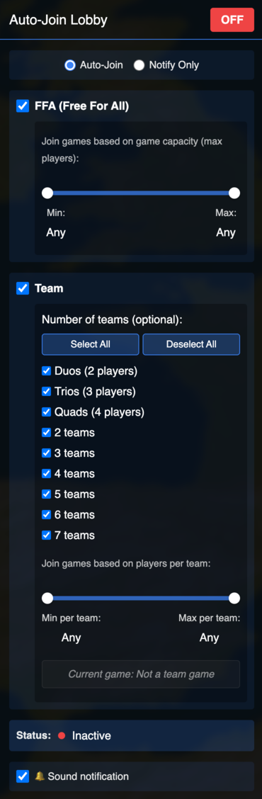

# OpenFrontIO Auto-Join Lobby

A Tampermonkey/Greasemonkey userscript that automatically joins lobbies on OpenFront.io based on your game mode preferences and game capacity filters. Includes a "Notify Only" mode that alerts you when matching games are found without automatically joining.



## Disclaimer

**This script has been entirely written by AI.** Use at your own discretion. The script is provided as-is without any warranties or guarantees.

### Compatibility

Tested and 100% functional against OpenFront v0.26.16

## Features

- **Game Mode Support**
  - **FFA (Free For All)**: Auto-join Free For All lobbies
  - **Team Mode**: Auto-join Team lobbies with support for:
    - Duos (2 players per team)
    - Trios (3 players per team)
    - Quads (4 players per team)
    - 2-7 teams configurations
    - All team configurations (when no specific team count is selected)

- **Game Capacity Filters**
  - **FFA Mode**: Filter based on total game capacity (maximum players the game can hold)
    - Visual range sliders for easy min/max capacity selection (1-100 players)
    - Minimum capacity filter: Only join games that can hold at least X players
    - Maximum capacity filter: Only join games that can hold at most X players
  - **Team Mode**: Filter based on players per team (more accurate for team-based games)
    - Visual range sliders for easy min/max players per team selection (0-50 players)
    - Minimum players per team filter: Only join games with at least X players per team
    - Maximum players per team filter: Only join games with at most X players per team
  - Filters can be set independently for FFA and Team modes
  - If capacity information is unavailable, the filter is bypassed (allows join)

- **Join Modes**
  - **Auto-Join Mode** (default): Automatically joins matching lobbies when found
  - **Notify Only Mode**: Displays a notification banner when matching games are found without automatically joining
    - Notification shows game details (mode, team configuration, player capacity)
    - Auto-dismisses after 10 seconds or can be clicked to dismiss manually
    - Prevents duplicate notifications for the same lobby
    - Useful for manually reviewing games before joining

- **Smart Auto-Join**
  - Automatically disables when returning to lobby (prevents immediate rejoin)
  - Permanently blocks auto-rejoin of recently left lobbies (only clears when joining a different lobby)
  - Visual feedback with search timer
  - Status indicators (Active/Inactive/Joined/Searching)
  - Sound notification when a matching game is found (can be toggled on/off)

- **User Interface**
  - Join mode selector (Auto-Join / Notify Only) with radio buttons
  - Draggable panel (position is saved)
  - Toggle ON/OFF button
  - Visual range sliders for capacity filtering with live value display
  - Real-time search timer display
  - Current game info display showing players per team for team games
  - Prominent notification banner (in Notify Only mode) with game details
  - Sound notification toggle (🔔 Sound notification checkbox)
  - Settings persistence across page reloads (including join mode preference)
  - Clean, modern dark theme UI

## Installation

### Easy Installation (Recommended)

**Install directly from GreasyFork:**
1. Make sure you have a userscript manager installed:
   - [Tampermonkey](https://www.tampermonkey.net/) (Chrome, Firefox, Edge, Safari)
   - [Greasemonkey](https://www.greasespot.net/) (Firefox)
   - [Violentmonkey](https://violentmonkey.github.io/) (Chrome, Firefox, Edge)
2. Click here to install: **[Install from GreasyFork](https://greasyfork.org/en/scripts/555551-openfrontio-auto-join-lobby)**
3. Navigate to [OpenFront.io](https://openfront.io/) and the Auto-Join panel should appear in the top-right corner

### Manual Installation

1. Install a userscript manager:
   - [Tampermonkey](https://www.tampermonkey.net/) (Chrome, Firefox, Edge, Safari)
   - [Greasemonkey](https://www.greasespot.net/) (Firefox)
   - [Violentmonkey](https://violentmonkey.github.io/) (Chrome, Firefox, Edge)

2. Install the script:
   - Open `openfront-autojoin.user.js` in your browser
   - Your userscript manager should detect it and prompt you to install
   - Or copy the script content and create a new script in your userscript manager

3. Navigate to [OpenFront.io](https://openfront.io/) and the Auto-Join panel should appear in the top-right corner

## Usage

### Basic Setup

1. **Choose Join Mode**
   - Select **"Auto-Join"** (default) to automatically join matching lobbies when found
   - Select **"Notify Only"** to receive notifications when matching games are found without automatically joining
   - Your mode preference is saved and restored on page reload

2. **Select Game Mode(s)**
   - Check the "FFA (Free For All)" checkbox to enable FFA auto-join
   - Check the "Team" checkbox to enable Team mode auto-join

3. **Configure Team Counts (Optional)**
   - If Team mode is selected, you can optionally specify which team configurations to join
   - Use "Select All" / "Deselect All" buttons for quick selection
   - If no team counts are selected, the script will join any Team mode lobby

4. **Set Game Capacity Filters (Optional)**
   - **For FFA Mode**: Use the visual range sliders to set minimum and maximum total game capacity
     - Drag the sliders to adjust the range (1-100 players)
     - The displayed values show "Any" when set to the full range (min: 1, max: 100)
   - **For Team Mode**: Use the visual range sliders to set minimum and maximum players per team
     - Drag the sliders to adjust the range (0-50 players per team)
     - The displayed values show "Any" when set to the full range (min: 0, max: 50)
     - A "Current game" info display shows the players per team for the currently displayed lobby
   - Only games matching your selected range will be joined
   - If you set both sliders to the full range (Any/Any), all matching game modes will be joined

5. **Configure Sound Notification (Optional)**
   - Check/uncheck the "🔔 Sound notification" checkbox to enable/disable sound alerts
   - When enabled, a chime sound plays when a matching game is found
   - When enabled, a boxing ring bell sound (three rings: ding ding ding) plays when the game starts/joins
   - Sound setting is saved and persists across page reloads

6. **Enable Auto-Join / Notify**
   - Click the "OFF" button to toggle it to "ON"
   - The script will start searching for matching lobbies
   - A search timer will display how long you've been searching
   - **In Auto-Join mode**: The script will automatically join when a match is found
   - **In Notify Only mode**: A notification banner will appear at the top of the screen when a match is found
   - If sound notification is enabled, you'll hear a chime when a match is found, and a boxing ring bell (three rings: ding ding ding) when the game starts/joins

### Status Indicators

- **Red indicator**: Auto-join/Notify is OFF (Inactive)
- **Green pulsing indicator**: Auto-join/Notify is ON (Active/Searching)
- **Status text**: Shows "Inactive", "Active", "Searching" (in Notify mode), or "Joined" (in Auto-Join mode)
- **Search timer**: Displays search duration or "Game found!" message when a match is found
- **Notification banner** (Notify Only mode): Appears at the top center of the screen showing game details when a match is found
- **Current game info**: For Team mode, displays "X players per team" for the currently shown lobby (only visible on lobby page)

### Panel Controls

- **Join Mode Selector**: Choose between "Auto-Join" and "Notify Only" modes using the radio buttons
- **Drag**: Click and drag the header to move the panel around
- **Toggle**: Click the ON/OFF button to enable/disable auto-join/notify
- **Sound Toggle**: Check/uncheck the sound notification checkbox to enable/disable audio alerts
- **Notification Banner** (Notify Only mode): Click the notification to dismiss it manually, or wait for it to auto-dismiss after 10 seconds
- **Settings**: All settings (join mode, game modes, filters, sound preference) are automatically saved and restored on page reload

## Configuration

The script uses the following default configuration:

```javascript
pollInterval: 1000ms  // How often to check for matching lobbies
rootURL: 'https://openfront.io/'  // Root URL for lobby detection
```

These can be modified in the script's `CONFIG` object if needed.

## Behavior

- **Auto-disable on game start**: When you enter a game, auto-join automatically turns OFF
- **Auto-disable on lobby return**: When you return to the lobby, auto-join automatically turns OFF (prevents immediate rejoin)
- **Auto-restart on lobby leave**: When you leave a lobby (via leave-lobby event), auto-join restarts searching if it was enabled
- **Permanent block on recently left lobby**: Once you leave a lobby, it is permanently blocked from auto-rejoin. The block is only cleared when you join a different lobby
- **Always starts OFF**: Auto-join/Notify always starts in the OFF state, even if it was enabled when you last visited
- **Settings persistence**: Your join mode preference, game mode preferences, capacity filters, and sound preference are saved and restored
- **Panel position**: The panel's position is saved and restored
- **Notification behavior**: In Notify Only mode, notifications are automatically dismissed when entering a game or returning to lobby

## Technical Details

- **Storage**: Uses Tampermonkey's `GM_setValue`/`GM_getValue` for settings persistence
- **Lobby Detection**: Monitors the `public-lobby` web component for available lobbies
- **Capacity Filtering**:
  - FFA mode: Filters based on total game capacity (`maxClients`, `config.maxClients`, or `config.maxPlayers` properties)
  - Team mode: Filters based on players per team (calculated from total capacity divided by number of teams)
- **Join Method**: Clicks the join button programmatically (provides visual feedback)
- **URL Detection**: Uses URL-based detection to determine game state (lobby vs. in-game)
- **Polling**: Checks for matching lobbies every 1 second when enabled
- **Sound Notification**: Uses Web Audio API to generate two distinct sounds: a chime notification (`playGameFoundSound()`) when a matching game is found, and a boxing ring bell sound (three rings: ding ding ding) (`playGameStartSound()`) when the game starts/joins. Audio context creation is separated from the play calls, with sounds triggered at the appropriate events
- **Notification System**: In Notify Only mode, displays a prominent banner notification with game details, auto-dismisses after 10 seconds, and tracks notified lobbies to prevent duplicates
- **UI Components**: Uses HTML5 range sliders with visual track fill for capacity selection
- **Game Info Display**: Real-time display of players per team for team games, updating every second
- **Mode Management**: Join mode preference (`autojoin` or `notify`) is stored and restored with other settings

## Version

Current version: **1.4.2**

## Author

DeLoVaN

## License

This userscript is provided as-is for personal use.
